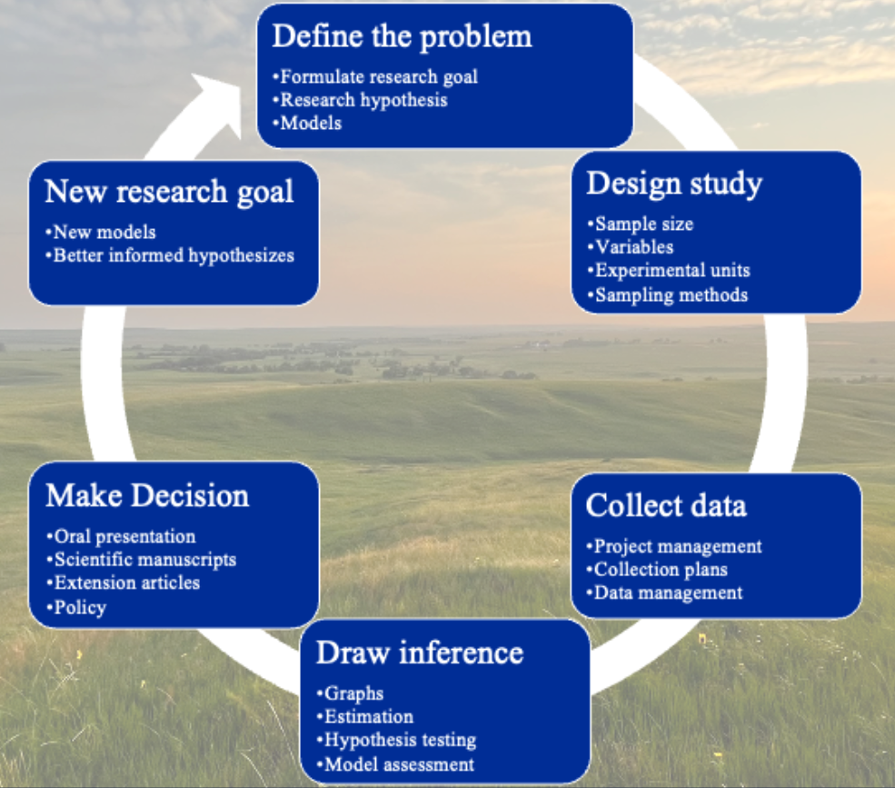

# Introduction {#intro}   

> "Mathematics is the languange in which God has written the Universe"
>
>--- Galileo Galilei

Scientists major challenge is to create a logical line of inference extending from what we know about a system in light of our observations and create new insight tempered by some uncertainty. Using the scientific method, mathematical modeling and statistics have gone to great lengths to establish this domain of truth, resulting in the dramatic leaps forward in scientific knowledge and the with the availability of statistical software has pioneered a scientific revolution in technological progress.   

```{r scimethod, echo=F, fig.cap='The scientific method is the cornerstone of scientific research, and when paired with mathematics and modern statistical methods, has revolutionized the rate of discovery.'}

```

However, the same structures that have afforded remarkable scientific progress are also inherently limiting. Many common statistical methodologies are designed around bespoke experimental designs, assumptions of data type and distributions, and are sensitive to the number of observations taken using various sampling methods [@wassersteinASAStatementValues2016; @johnsonCommentsASAStatement2016], and generated some concern regarding the reliability of published research findings [@ioannidisWhyMostPublished2005], with alternatives to null hypothesis testing yielding marginal success, with many statisticians pleas to correctly utilize the p-value falling on researchers deaf ears [@matthewsValueStatementFive2021]. Perhaps more importantly, there is an ever decreasing suite of novel questions which may be asked by a single investigator, even if they are particularly advanced and talented. This problem becomes even more intimidating for young investigators. The ability to write new and unique models using the creativity of inter-disciplinary teams increases the depth and breadth of available questions [@hobbsBayesianModelsStatistical2015]. 

Additional training should increase comfort with functional modeling and a deeper perspective of natural stochastic and modeling probability in complex ecological systems. The overarching goal of this class is to both increase scientists comfort with writing mathematical process models which describe their system, and basic statistical principles needed to describe the probability inherent to their system. There are many technical aspects surrounding this methodology, and my belief is that no matter whether you consider yourself a Frequentist, Bayesian, or Pragmatic statistitian, that their is tremendous value in pursuing deeper intelectual knowledge of system stoichasticiy and probability which will inevitably increase the intellectual satisfaction we take from our work.

## Install Jags

Before installing rjags, we have to install Jags for it to interface with. Refer to [mcmc-jags.sourceforge.io](https://mcmc-jags.sourceforge.io) and download the appropriate files for your machine type and install. 

## Install these packages

```{r}
# Libraries to install
# List of packages to check/install
packages <- c("data.table", "tidyverse", "rjags", "MCMCvis", "ggExtra")

# Function to check and install packages
install_if_missing = function(pkg) {
  if (!require(pkg, character.only = TRUE)) {
    install.packages(pkg, dependencies = TRUE)
    library(pkg, character.only = TRUE)
  } else {
    cat(paste("Package", pkg, "is already installed.\n"))
  }
}

# Apply the function to each package in the list
lapply(packages, install_if_missing)


# devtools::install_github("irap93/Bayesdemo") # Uncomment out this line install for data 

# Libraries
library(Bayesdemo)
library(data.table)
library(tidyverse)
library(rjags)
library(MCMCvis)
library(ggExtra)
```

