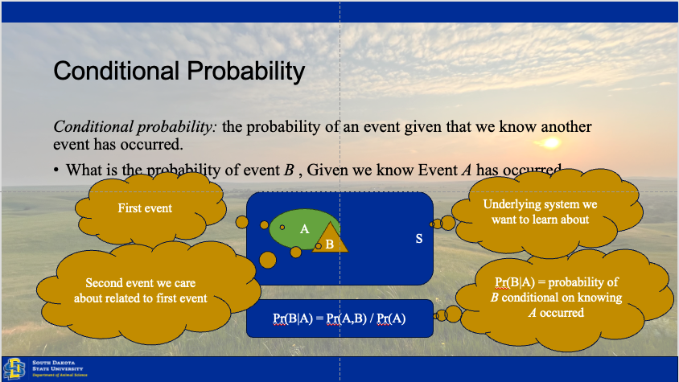
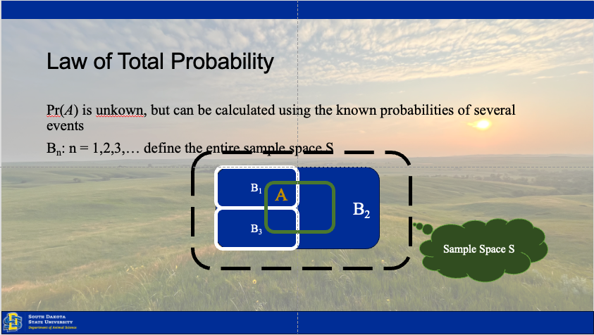
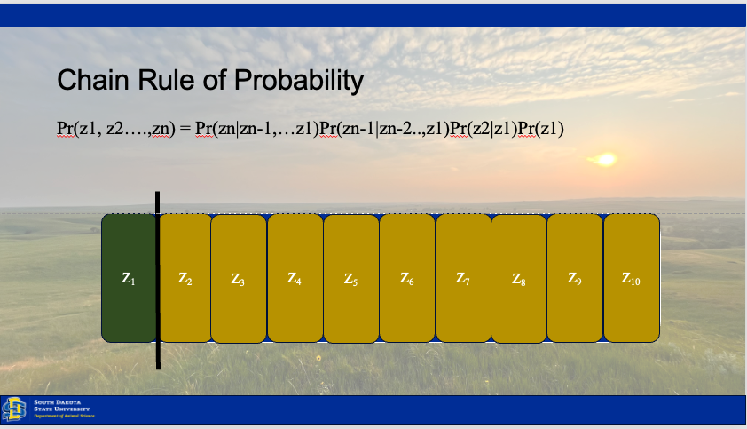
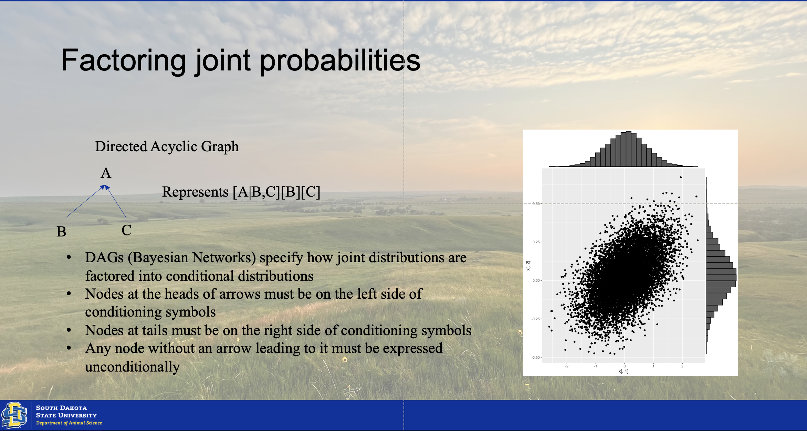

# Probability Distributions {#probs}

## Three rules of probability  

### Conditional Probability  

```{r condprob, echo=F, fig.cap=''}

```

### Total Probability  

```{r totprob, echo=F, fig.cap=''}

```

### Chain Rule of Probability  


```{r chainprob, echo=F, fig.cap=''}

``` 

## Establishing inference
Establishing inference involves understanding how the state of our ecological system changes over time, between individuals, or across space. Our results rely upon observations drawn from the system, because the system (total space) is to large to observe in totality [@hobbsBayesianModelsStatistical2015]. Thus, we have three sources of variation which may be driving our collected data.

```{r linkprob}
# Linked probability functions ----

par(mfrow = c(1,3))
# Process model -----
z = rnorm(1000, mean =0, sd = 1)
# density(z)
plot(density(z), 
     main = expression(atop('Process Model', paste(italic('g'),'(',theta[p],',',italic('x'),')'))), 
     xlab = 'z', ylab = 'Probability density')
abline(v=0, col = 'blue')

# Sampling Model ----
u = rlnorm(1000, 0, 1)
plot(density(u), 
     main = expression(atop('Sampling Model',italic(z))),
     xlab = expression(italic(u[i])), ylab = '')
abline(v = mean(u), col = 'blue')

# Observation model ----
y = rlnorm(1000)
plot(density(y), 
     main = expression(atop('Observation Model', paste(italic('d'),'(',theta[o],',',italic(u[i]),')'))), 
     xlab = expression(italic(y[i])), ylab = '')
abline(v = mean(y), col = 'blue')

```

### Process model  

First is the process model, or a deterministic function which represents some *theoretical* state of the system based upon our current conceptual understanding. The process model can come from our own understanding or observation of the system, pilot data, or previous studies. The process model should include our prediction of how the system functions, including any natural or imposed effects from treatments on the system. The process function is represented by $$g(\Theta_p, x)$$. An example of a process model might be a linear growth function $$f(x) = mx + b$$ where fixed values of *m* and *b* get mapped as a single function of our variable of interest. 

```{r processmod}
x = seq(1,12, 1) # Independent X parameter placed on the X axis
b0 = 1 # Specify the Y intercept
b1 = 3 # Specify the B1 coefficient i.e. the slope
y = b0 + b1*x

par(mfrow = c(1,3))
hist(x)
hist(y)
{
plot(x,y, ylim = c(0,max(y)), main = expression(y == beta[0] + beta[1]*x))
abline(lm(y~x), col = 'blue')
}
par(mfrow = c(1,1))
summary(lm(y~x))
```

### Sampling model  
The sampling model accounts for the precision in observational methods of the systems true state. Uncertainty arises as our observations most definitely do not represent the system's true state. We can estimate this stoichastistically using the expression $$[u_i|z,\sigma_s^2]$$ which assumes we can collect many observed instances of the true system state without bias, and *z* will arise to represent approximately the true state of the system for that variable. This can be added to our above process model by modeling the variance of the sampling method of our observed values, *Y*. 

```{r sampmod}
n = length(y) # Number of random values to generate
u = 3 # approximate mean of the variation of the systems sampling values
sigma = 5 # Standard deviation of the systems sampling values
e = rnorm(length(y),u,sigma)

ui = y + e
{
plot(x,ui, ylim = c(0,max(ui)), main = expression(y == beta[0] + beta[1]*x + epsilon))
abline(lm(y~x), col = 'blue')
}
par(mfrow = c(1,1))
summary(lm(ui~x))
```

### Observation model  

The observation model is similar to the sampling model sketched out previously, but rather than accounting for the variation due to our sampling processes, the observation model accounts for the inherent variation between the observed units of a system. Much as we might like to, it is impossible to measure the height of every blade of grass, biomass from every acre, or nutrient concentration from every bit of feed fed in our diets. Therefore, we can model the distribution of the inherent variation of the system in a similar fashion.

## Reading density distributions

```{r}
# devtools::install_github("irap93/Bayesdemo") # Uncomment out this line install for data 

# Libraries
library(Bayesdemo)

# Data
data("heifer")

hist(heifer$Day56_InitialBW)

plot(density(heifer$Day56_InitialBW))
abline(v = quantile(heifer$Day56_InitialBW, c(.025, .975)), col = "red", lwd = 2)
abline(v = quantile(heifer$Day56_InitialBW, c(0.75)), col = 'blue', lwd = 2)
```


# Conjugate Priors 

Below is an example of conjugation of priors, sample and posterior distributions.

```{r conjugatepriors}
# Set seed for reproducibility
set.seed(1)

# 1. Define the prior: Normal(mu_0, sigma_0^2)
mu_prior = 0        # Prior mean
sigma_prior = 1     # Prior standard deviation
var_prior = sigma_prior^2  # Prior variance

# 2. Simulate some data: Normal observations with known variance
sigma = 2       # Known population standard deviation
sigma_sq = sigma^2  # Known population variance
n = 50          # Number of observations
true_mu = 1     # True mean for simulation
data = rnorm(n, mean = true_mu, sd = sigma)  # Simulated data
sample_mean = mean(data)  # Observed sample mean

# 3. Compute the posterior: Normal(mu_n, sigma_n^2)
# Posterior precision = 1/sigma_0^2 + n/sigma^2
posterior_precision = 1/var_prior + n/var_prior
posterior_variance = 1/posterior_precision
posterior_sd = sqrt(posterior_variance)
posterior_mean = (mu_prior/var_prior + n*sample_mean/sigma_sq) / posterior_precision

# 4. Plot the prior, likelihood, and posterior
# Create a sequence of possible mu values
mu <- seq(-3, 3, length.out = 100)

# Prior density: Normal(mu_0, sigma_0^2)
prior <- dnorm(mu, mean = mu_prior, sd = sigma_prior)

# Scaled likelihood: Normal(sample_mean, sigma^2/n)
likelihood <- dnorm(mu, mean = sample_mean, sd = sigma/sqrt(n))
likelihood <- likelihood / max(likelihood)  # Scale for visualization

# Posterior density: Normal(posterior_mean, posterior_variance)
posterior <- dnorm(mu, mean = posterior_mean, sd = posterior_sd)

# Plot
plot(mu, posterior, type = "l", col = "blue", lwd = 2, 
     xlab = "Mean (mu)", ylab = "Density", 
     main = "Normal-Normal Conjugate Prior Example")
lines(mu, prior, col = "red", lwd = 2, lty = 2)
lines(mu, likelihood, col = "green", lwd = 2, lty = 3)
legend("topleft", legend = c("Posterior", "Prior", "Scaled Likelihood"), 
       col = c("blue", "red", "green"), lwd = 2, lty = c(1, 2, 3))

# 5. Summarize the results
cat("Prior: Normal(mean = ", mu_prior, ", sd = ", sigma_prior, ")\n")
cat("Data: Sample mean = ", round(sample_mean, 3), ", n = ", n, ", known sd = ", sigma, "\n")
cat("Posterior: Normal(mean = ", round(posterior_mean, 3), ", sd = ", round(posterior_sd, 3), ")\n")
cat("Posterior Variance: ", round(posterior_variance, 3), "\n")


```


# Joint Distributions  

The joint distribution results from the conjugation of two or more posterior distributions of multiple factors or parameters from the model. There are two ways of finding this conjugated distribution. The moments of the two distributions can be matched using calculus **If they hold these moments in common**. However, this is not always a given, and many times the distributions may not hold moments in common. This is where the computational intensity of Bayesian statistics comes into play. We will utilize a Monte Carlo simulation model to create a simulation of the conjugated distribtution model. We will implement it using a gibbs sampler, typical of the one illustrated below. 

```{r jointprob, echo=F, fig.cap=''}

```

## Marcov Monte Carlo

```{r MCMCsample}
# Set random seed for reproducibility
set.seed(123)

# Parameters for bivariate normal distribution (based on typical livestock data)
mu_fi <- 6.0    # Mean feed intake (kg/day)
mu_adg <- 0.8   # Mean average daily gain (kg/day)
sigma_fi <- 1.0 # Standard deviation for feed intake
sigma_adg <- 0.2 # Standard deviation for ADG
rho <- 0.7      # Correlation coefficient (positive correlation between FI and ADG)

# Function to sample from conditional distribution of feed intake (FI) given ADG
sample_fi_given_adg <- function(adg, mu_fi, mu_adg, sigma_fi, sigma_adg, rho) {
  mean <- mu_fi + rho * (sigma_fi / sigma_adg) * (adg - mu_adg)
  variance <- sigma_fi^2 * (1 - rho^2)
  rnorm(1, mean, sqrt(variance))
}

# Function to sample from conditional distribution of ADG given feed intake (FI)
sample_adg_given_fi <- function(fi, mu_fi, mu_adg, sigma_fi, sigma_adg, rho) {
  mean <- mu_adg + rho * (sigma_adg / sigma_fi) * (fi - mu_fi)
  variance <- sigma_adg^2 * (1 - rho^2)
  rnorm(1, mean, sqrt(variance))
}

# Gibbs sampler function
gibbs_sampler <- function(n_samples, mu_fi, mu_adg, sigma_fi, sigma_adg, rho) {
  samples <- matrix(0, nrow = n_samples, ncol = 2)
  fi <- mu_fi   # Initial value for feed intake
  adg <- mu_adg # Initial value for ADG

  for (i in 1:n_samples) {
    fi <- sample_fi_given_adg(adg, mu_fi, mu_adg, sigma_fi, sigma_adg, rho)
    adg <- sample_adg_given_fi(fi, mu_fi, mu_adg, sigma_fi, sigma_adg, rho)
    samples[i, ] <- c(fi, adg)
  }

  return(samples)
}
samples

# Run the Gibbs sampler
n_samples <- 10000
samples <- gibbs_sampler(n_samples, mu_fi, mu_adg, sigma_fi, sigma_adg, rho)

plot(1:nrow(samples), samples[,1], type = 'l', col = 'blue', main = 'Feed Intake')
plot(1:nrow(samples), samples[,2], type = 'l', col = 'blue', main = 'ADG')

# Name the columns for clarity
colnames(samples) <- c("Feed_Intake", "ADG")

# Plot the joint distribution (scatter plot)
plot(samples[, "Feed_Intake"], samples[, "ADG"],
     xlab = "Feed Intake (kg/day)", ylab = "Average Daily Gain (kg/day)",
     main = "Joint Distribution of Feed Intake and ADG",
     pch = 20, cex = 0.5, col = rgb(0, 0, 1, alpha = 0.5))

# Plot marginal distributions
par(mfrow = c(1, 2)) # Set up a 1x2 plot layout

# Marginal distribution of Feed Intake
hist(samples[, "Feed_Intake"], breaks = 50, main = "Marginal Distribution of Feed Intake",
     xlab = "Feed Intake (kg/day)", col = "lightblue", probability = TRUE)
lines(density(samples[, "Feed_Intake"]), col = "red", lwd = 2)

# Marginal distribution of ADG
hist(samples[, "ADG"], breaks = 50, main = "Marginal Distribution of ADG",
     xlab = "Average Daily Gain (kg/day)", col = "lightgreen", probability = TRUE)
lines(density(samples[, "ADG"]), col = "red", lwd = 2)

# Reset plot layout
par(mfrow = c(1, 1))
p <- ggplot(NULL, aes(x=samples[,"Feed_Intake"], y=samples[,"ADG"]))+
  geom_point()
# ggMarginal(data = NULL, p = p, x=samples[,"Feed_Intake"], y=samples[,"ADG"], type = "histogram" )
ggMarginal(data = NULL, p = p, x=samples[,"Feed_Intake"], y=samples[,"ADG"], type = "densigram", color = 'blue', fill = 'grey')

```
