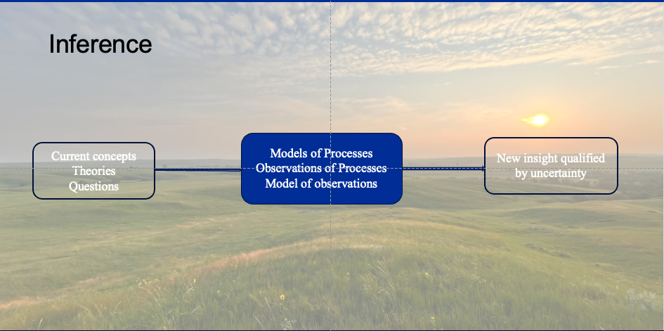

--- 
title: "NANP Bayesian Workbook"
author: "Ira L. Parsons"
date: "`r Sys.Date()`"
site: bookdown::bookdown_site
documentclass: book
bibliography: [book.bib, packages.bib]
# url: your book url like https://bookdown.org/yihui/bookdown
# cover-image: path to the social sharing image like images/cover.jpg
description: |
  This is a workbook written to accompany the Bayesian Seminar and Workshop presented by Dr. Ira Parsons and the 2025 National Animal Nutrition Program presymposium for the American Society of Animal Scientists, held in Hollywood Florida.
link-citations: yes
github-repo: rstudio/bookdown-demo
---

# Abstract {-}

> "How do you know what you know, and how do you show what you know is really so?"
>
> --- Storytime with Ira  

The ability to ask important questions and provide compelling answers will determine the impact of your scientific research. Bayes Theorem provides foundational principles for developing full mathematical expressions that incorporate process models, sampling methods, observational error, and prior knowledge of the biological system. This workshop’s goal is to provide participants with an avenue to free themselves from the inadequacies of procedural, outcome-oriented statistical methods and facilitate scientists to ask important questions using a first principles approach to biological questions. Application of inverse probability theory can be found across disciplines such as epidemiology, social science, computer science, artificial intelligence, and life sciences. In preparation for the workshop, participants should ensure they have R and their favorite R GUI installed, along with the packages rjags. By providing a comprehensive overview of developing and implementing process-based Bayesian models, participants should gain practical insight into the utility of first principles-based statistical modeling methodology and greater confidence to embark on their own quest to ask insightful scientific questions.  


```{r modframe, echo=F, fig.cap='Fundamental challenge of ecological research is to create a credible line of inference from what we know to new insight based upon our observations and tempered by uncertainty.'}

```


```{r include=FALSE}
# automatically create a bib database for R packages
knitr::write_bib(c(
  .packages(), 'bookdown', 'knitr', 'rmarkdown', 'tidyverse', 'datatable'
), 'packages.bib')
```
